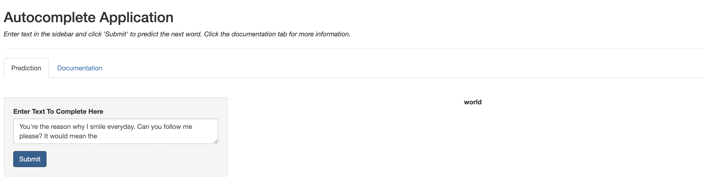

```{r setup, include=FALSE}
knitr::opts_chunk$set(echo = FALSE)
```

## Overview

The Autocomplete Application takes any incomplete English language phrase as input and outputs a prediction for the next word in the phrase. This is accomplished with:

- A 4-gram language model (LM)
- Modified "Stupid" Backoff: An experimental method for dealing with unknown n-grams

## Base Language Model

- Makes predictions using Maximum Likelihood Estimation (MLE) of the 4th word based the last 3 words of the phrase (Markov assumption)
    - Trained on a collection of news, blogs, and Twitter text data
    - Calculates MLE probabilities for predictions based on training data
    - Predicts using these static probabilities

## Modified Stupid Backoff

- Method for dealing with unseen 3-grams whereby the 4-gram LM prediction algorithm "backs off" to a 3-gram LM and uses only the last 2 words to predict
- When we back off, a pseudo-probability is calculated by discounting the MLE probability by some constant (0.55 is used in the model)
- Novel Modification: Predictions from all n-gram language models are combined together always (even when the 4-gram LM knows the last 3 words), and the prediction with the highest (discounted) probability is chosen

## The App

The web application for this app is available [here](https://akota64.shinyapps.io/Autocomplete_Application/). Give it a try!

- Please allow 15-30 seconds to load the model
- Enter any text, phrase, or incomplete sentence(s) in the side bar and click 'Submit'
- Prediction is displayed in the main panel
- Check 'Documentation' for more information


